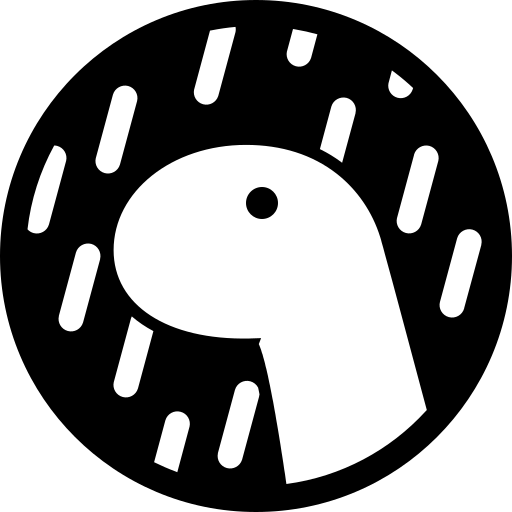

# Muhammad Adam Zaky Jiddyansah 👋

## Linux Enthusiast | Tech Hobbyist

Just a student who enjoys exploring the digital world. I spend most of my time tinkering with my system, learning new stuff, or just playing games. I'm into automation because I'm basically lazy and want my computer to do the work for me.

- 💻 **Daily Driver:** Currently hopping on **CachyOS** with **Hyprland** WM. Loving the smoothness!
- ⚡ **Fun Fact:** Aside from coding, I like modding Caferacer.
- 🌱 **Currently Learning:** Just trying to get better at Bash and exploring some Data Analysis tools and Computer Networking skiils.
- 🥅 **2026 Goals:** Stay curious and keep digging into tech info.

### 🌐 Connect with me:

&nbsp;&nbsp;

&nbsp;&nbsp;

 

### 🛠 Languages and Tools:

**Stuff I Use:**

**Web & Data:**

 
 

---

### 📊 My Stats

*© 2026 Muhammad Adam Zaky Jiddyansah.*
